1. Download and install the [Windows IoT Dashboard](https://developer.microsoft.com/en-us/windows/iot/docs/iotdashboard).  The Dashboard provides a convenient means of setting up the devices (essentially running the command line tools) and accessing the devices. 

1. Stick a Class 10 Micro SD card into your laptop.

    

1. Use the Windows IoT Dashboard to set up new device.  Don't check the "Wi-Fi Network Connection".  It is easiest (apparently most reliable) to configure the device with a direct connnection using an ethernet cable.  If you don't have access to the router on the Wi-Fi network you might not be able to find it's IP address.  Theoretically the Windows IoT Dashboard should show you all the devices attached to the network but this isn't reliable.

    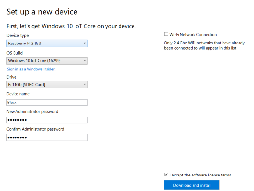
    
    The password is unique to the device.  So keep a record.  To administer the device you will need to password.  Accept the terms and conditions, then "Download and install".  If you haven't already done this, or if the OS Build has changed then you'll have to wait for the download. 

1. If you have set up an SD card previously you should get a warning about erasing the SD card.

    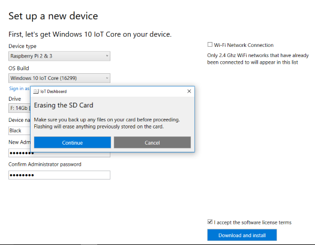

1. If there is a previous installation to be dealt with the dashboard will run the tool to clean it up.

    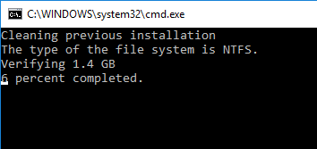
    
    If it is a fresh SD card you shouldn't see these two.

1. The DISM commandline tool is then used to apply the image to the SD card.

    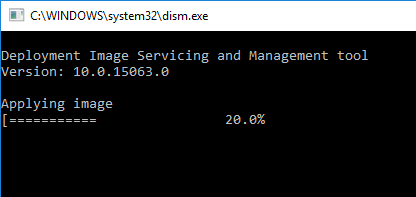

1. Once the card is setup you should see this.

    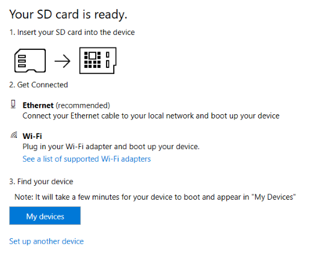

1. Put the SD card in the Raspberry Pi, attach it directly to your laptop with the ethernet cable and turn it on.  First boot is the longest whilst Windows sets up, so be patient.
Attach a screen to the Raspberry Pi so you can see what is going on.

    

1. Once the Raspberry Pi has started it should appear in the device list on the Dashboard.

    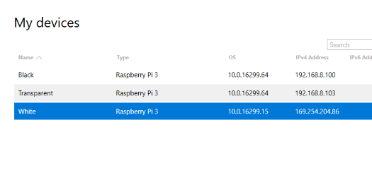
    
    Sometimes this doesn't happen.  It relies on ebootpinger.exe running on the Raspberry Pi.  So if it doesn't happen the recommendation is to restart ebootpinger.exe on the Raspberry Pi.  If you are relying on the dashboard to find the Raspberry Pi (because you don't have access to the router) this isn't very useful advice.  Rebooting the device can sometimes get it to appear.  If it doesn't I then attach a screen, the default application on the device shows the IP address and you can use this in a browser to open the device portal.

    Also note that the new device has a different OS version.  The operating system will need to be updated. The IP address is in the APIPA (Automatic Private IP Addressing) range because it is a direct connection.
    
1. Right click on the device and open in the device portal.

    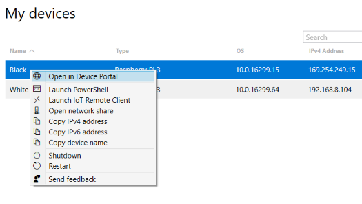
     
1. The device portal should allow you to change setting on the device, such as the name etc...

    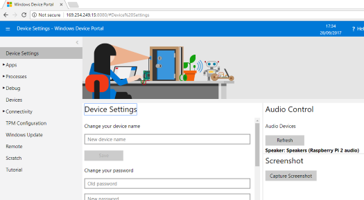
    
1. Adjust the time zone to the times on the logs make sense to you.

    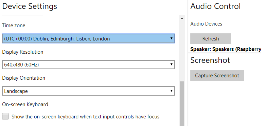

1. Set up the network connection, selecting the prefered network and providing the password.  This should automatically set up a profile as the same time.  In the event that the network requires authentication via a browser, this will need to be done by attaching a screen, keyboard and mouse to the device.

    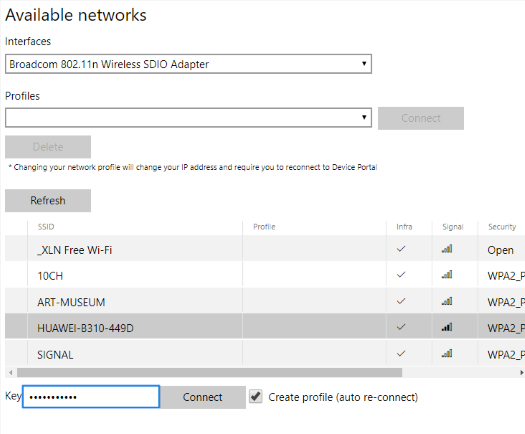
    
1. Windows will need updating so ensure that the updates have been downloaded.

    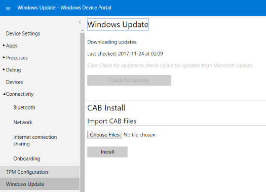
    
1. Restart the device.

    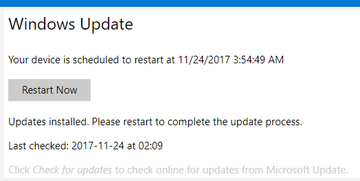

1. The restart doesn't always work so it is easiest just to turn it off and on again.

    
    
1. Installing the updates may take some time so it might be as well in plug in a monitor so you know what is going on.

    
    

Now proceed to [on boarding]({{ site.baseurl }}/onboarding) to create the device data entry and associate the physical device with it. This is required before the device can start using the patrons API.
