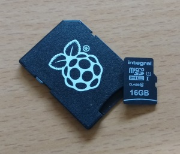
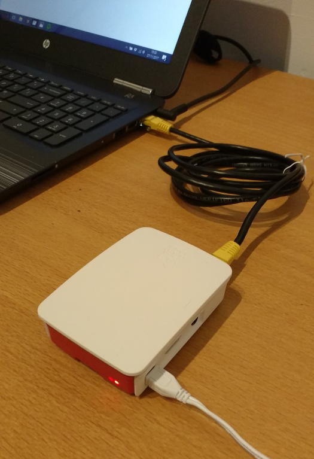

1. Download and install the [Windows IoT Dashboard](https://developer.microsoft.com/en-us/windows/iot/docs/iotdashboard).  The Dashboard provides a convenient means of setting up the devices (essentially running the command line tools) and accessing the devices. 

1. Stick a Class 10 Micro SD card into your laptop.  
    

1. Use the Windows IoT Dashboard to set up new device.  Don't check the "Wi-Fi Network Connection".  It is easiest (apparently most reliable) to configure the device with a direct connnection using an ethernet cable.  If you don't have access to the router on the Wi-Fi network you might not be able to find it's IP address.  Theoretically the Windows IoT Dashboard should show you all the devices attached to the network but this isn't reliable.
    
The password is unique to the device.  So keep a record.  To administer the device you will need to password.  Accept the terms and conditions, then "Download and install".  If you haven't already done this, or if the OS Build has changed then you'll have to wait for the download. 

1. If you have set up an SD card previously you should get a warning about erasing the SD card.
    

1. And the tool to clean the previous install will be run.
    
If it is a fresh SD card you shouldn't see these two.

1. The DISM commandline tool is then used to apply the image to the SD card.
    

1. Once the card is setup you should see this.
    

1. Put the SD card in the Raspberry Pi, attach it directly to your laptop with the ethernet cable and turn it on.
    

1. 
    

5. First boot is the longest whilst Windows sets up, so be patient.
Attach a screen to the Raspberry Pi so you can see what is going on.

6. May not appear on "My Devices" in which case get the Ethernet IP address from the screen.

Now proceed to [on boarding]({{ site.baseurl }}/onboarding) to create the device data entry and associate the physical device with it. This is required before the device can start using the patrons API.
